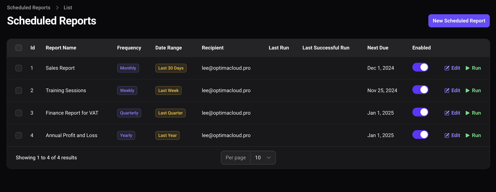
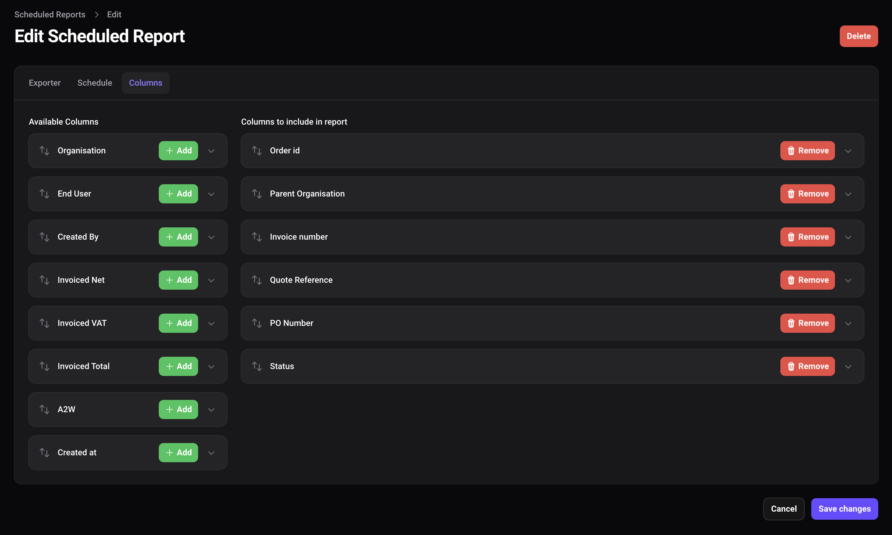

# Configure scheduled routines for filament exporters

[](https://packagist.org/packages/visualbuilder/filament-export-scheduler)
[](https://github.com/visualbuilder/filament-export-scheduler/actions?query=workflow%3Arun-tests+branch%3Amain)
[](https://github.com/visualbuilder/filament-export-scheduler/actions?query=workflow%3A"Fix+PHP+code+styling"+branch%3Amain)
[](https://packagist.org/packages/visualbuilder/filament-export-scheduler)

Email automated exports on a defined schedule - keep the management happy with timely reporting and minimise effort.



Any Filament Exporter can be set to run on a schedule. Set in the config where to look for Exporters


pick a frequency or add a custom cron for total flexibility.

* daily
* weekly
* monthly
* quarterly
* half-yearly
* yearly
* custom cron


Set a relative date range for the query results:-
(or leave blank for all rows)

* today
* yesterday
* last_7_days
* last_week
* last_30_days
* last_month
* this_month
* last_quarter
* this_year
* last_year



## Installation

You can install the package via composer:

```bash
composer require visualbuilder/filament-export-scheduler
```

Quick install views and migrations

```bash
php artisan export-scheduler:install
```

Optionally seed an example schedule for the users table
This will export all Users on the 1st of every month.

```bash
php artisan db:seed --class=ExportScheduleSeeder
```

## Schedule Command in Laravel

To enable automatic sending you must add the console command to your scheduler.

### 1. Modify the Scheduler

Open `app\Console\Kernel.php`:

```php
protected function schedule(Schedule $schedule)
{
    $schedule->command('export:run')->everyMinute();
}
```

### 2. Check servers cron

Ensure your server is set up to run Laravel's scheduler by adding this cron entry

```bash
* * * * * cd /path-to-your-project && php artisan schedule:run >> /dev/null 2>&1
```

## Review the config file

```php
return [

    /**
     * To customise the Export Schedule Resource put your own resource here
     */
    'resources' => [ExportScheduleResource::class],

    /**
     * The success Notification and Mailable to use
     */
    'notification' => ScheduledExportCompleteNotification::class,
    'mailable' => ExportReady::class,

    /**
     * Allow users to choose from Exporters in these directories
     */
    'exporter_directories' => [
        'App\Filament\Exporters',
    ],
    
    /**
     * Where the exports should be stored local, s3 
     */
    'file_disk' => 'local',
    
    /**
     * Admin Panel Navigation
     * See also Plugin options
     */
    'navigation' => [
        'enabled'      => true,
        'sort'         => 100,
        'label'        => 'Scheduled Report',
        'plural_label' => 'Scheduled Reports',
        'icon'         => 'heroicon-o-paper-airplane',
        'group'        => 'Reports',
        'cluster'      => false,
        'position'     => \Filament\Pages\SubNavigationPosition::Top
    ],

    /**
     * Which authenticatable models should be allowed to receive exports
     * Will be used to populate the Owner picker 
     */
    'user_models' => [

        [
            'model' => \App\Models\User::class,
            'title_attribute' => 'email',
        ],
    ],
];
```


Add the plugin to your filament panel provider
```php
use VisualBuilder\ExportScheduler\ExportSchedulerPlugin;

public function panel(Panel $panel): Panel
    {
        return $panel
            ->default()
            ->plugins([
                ExportSchedulerPlugin::make(),

```

## Testing

```bash
composer test
```

## Changelog

Please see [CHANGELOG](CHANGELOG.md) for more information on what has changed recently.

## Contributing

Please see [CONTRIBUTING](.github/CONTRIBUTING.md) for details.

## Security Vulnerabilities

Please review [our security policy](../../security/policy) on how to report security vulnerabilities.

## Credits

- [Lee Evans](https://github.com/lee)
- [All Contributors](../../contributors)

## License

The MIT License (MIT). Please see [License File](LICENSE.md) for more information.
